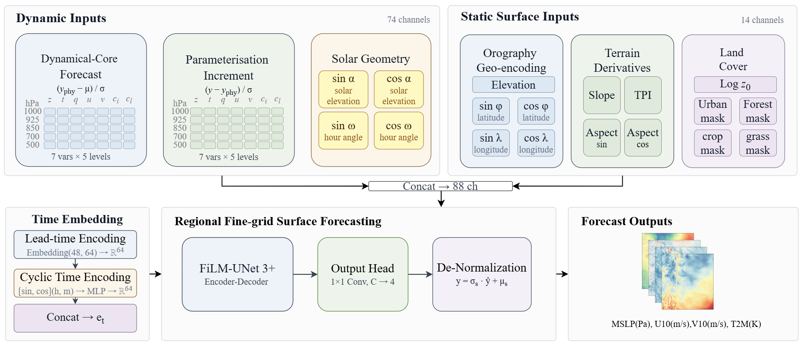

# AERO-ODE


## A Physics Guided Integrated Global to Regional Method for High Resolution Weather Forecasting

`AERO-ODE` is a physics-guided global-to-regional weather forecasting framework for fast, high-resolution regional prediction. Starting from global initial conditions, the model generates hourly 72 h regional forecasts at 3 km resolution, covering pressure-level variables and near-surface variables without requiring separate global surface lateral-boundary inputs.

## Model Architecture

**AERO-AIR: pressure-level variable prediction framework**


**AERO-Surface: surface-variable prediction framework**



## Visualization

**MSLP forecast comparison (initialized at 00 UTC on 1 January 2024)**

https://github.com/user-attachments/assets/885a7942-2d5e-4a63-a549-377119f7c7c7

**T2m forecast comparison (initialized at 00 UTC on 1 May 2024)**

https://github.com/user-attachments/assets/9661c7b1-1434-4647-b24f-9b25afdaa272

<sub>Note: These visualizations do not imply that AERO-ODE outperforms global models overall; they are intended only to illustrate its additional regional gains over the target domain.</sub>

## Environment Setup

### Method 1: Use the packed environment (preferred)

Because `AERO-ODE` depends on both JAX and PyTorch, which have strict version compatibility requirements, we provide a packed backup of the authors' virtual environment. Follow the steps below to restore the runtime environment.

#### Step 1: Find your conda envs directory

```bash
conda env list
```

For example:

```bash
/home/zhangjing09/miniconda3/envs/
```

#### Step 2: Create the target directory for the unpacked environment

```bash
mkdir -p /home/zhangjing09/miniconda3/envs/NeuralGCM_LAM
```

#### Step 3: Download and reassemble the packed environment

The packed environment (`NeuralGCM_LAM_Env.tar.gz`, ~2.98 GB) is published as a GitHub Release asset. Because a single release asset is limited to 2 GB, it is split into two parts. Download both parts from the [`env-v1` release](https://github.com/ZZzzzZZZV/AERO_ODE/releases/tag/env-v1) and reassemble them:

```bash
cat NeuralGCM_LAM_Env.tar.gz.part00 NeuralGCM_LAM_Env.tar.gz.part01 > NeuralGCM_LAM_Env.tar.gz
# Optional integrity check (SHA-256):
# 375604987cbb299130e5eefb317dd4985ca730155837b06be9faefb49ad51552
sha256sum NeuralGCM_LAM_Env.tar.gz
```

#### Step 4: Extract the archive

```bash
tar -xzvf NeuralGCM_LAM_Env.tar.gz -C /home/zhangjing09/miniconda3/envs/NeuralGCM_LAM
```

Please replace `/home/zhangjing09/miniconda3/envs/` with your own conda environment path.

#### Step 5: Activate and fix paths

Run `conda-unpack` once after the first activation to fix hard-coded paths in the packed environment.

```bash
source /home/zhangjing09/miniconda3/envs/NeuralGCM_LAM/bin/activate
conda-unpack
```

#### Step 6: Verify the installation

```bash
python -c "import jax; print('jax:', jax.__version__)"      # jax: 0.4.29
python -c "import torch; print('torch:', torch.__version__)"  # torch: 2.4.0+cu121
```

#### Daily activation

```bash
conda activate NeuralGCM_LAM
```

### Notes

| Topic | Details |
|---|---|
| `conda-unpack` | Run once after the first activation to fix hard-coded paths. |
| Cross-platform | Not supported. A Linux pack only works on Linux. |
| tar warnings | A few file warnings are acceptable if key packages import correctly. |


### Method 2: Create the environment manually

Install the required versions manually from `environment.yml`. This path is not recommended unless the packed environment cannot be used.

```bash
conda env create -f environment.yml -n NeuralGCM_LAM
```

## Data Preparation

This repository provides two types of datasets:

- **Minimal runtime dataset**: bundled with the code in the corresponding directories; no extra download is required and it can be used to quickly verify the workflow.
- **One-month full dataset**: download link TBD (XXXXXX); suitable for further experiment reproduction.

To expand the dataset, raw data can be obtained from the following official sources:

- HRRR: [https://rapidrefresh.noaa.gov/hrrr/](https://rapidrefresh.noaa.gov/hrrr/)
- ERA5: [https://cds.climate.copernicus.eu/](https://cds.climate.copernicus.eu/)

After downloading, apply bilinear interpolation using the latitude/longitude grid files provided in the `HRRR` folder to generate the model input format.

## Model Inference

### AERO-AIR

Run the following under the `AERO_AIR` directory:

```bash
python test_film_rb.py
```

Runs pressure-level variable prediction and computes RMSE; outputs and error curves are saved to `Test_Data_Rmse_00z`.

```bash
python Generate_Yearly_Forecast_rb.py
```

Generates full-year forecast data.

### AERO-Surface

Run the following under the `AERO_Surface` directory:

```bash
python test_film_00z_RMSE.py
```

Runs near-surface variable prediction and computes RMSE; outputs and error curves are saved to `Test_Surface_Rmse_00z`.

```bash
python Generate_Yearly_Forecast_Surface.py
```

Generates full-year near-surface forecast data.

### Result Visualization

Run the following under `AERO_ODE_Draw/Draw_New`:

```bash
python run_all_drawings.py
```

Automatically generates all curve figures used in the paper and saves them to the `Draw_New` directory.

## License

Released by Shanghai Zhangjiang Institute of Mathematics.

Commercial use of these models is prohibited.
