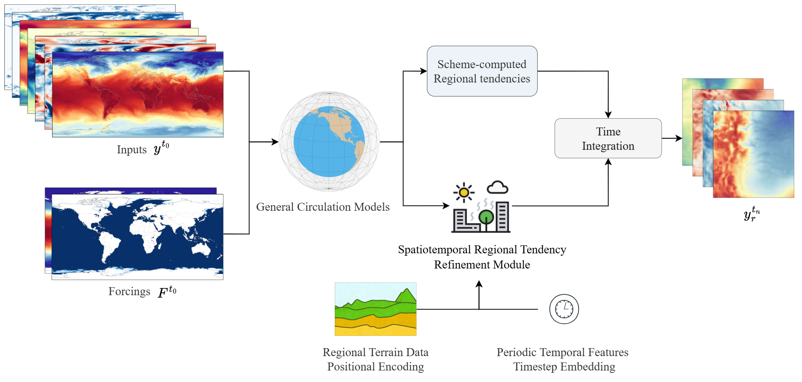
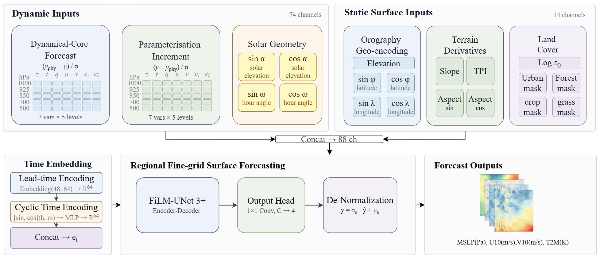

# AERO-ODE


## A Physics Guided Integrated Global to Regional Method for High Resolution Weather Forecasting

`AERO-ODE` is a physics-guided global-to-regional weather forecasting framework for fast, high-resolution regional prediction. Starting from global initial conditions, the model generates hourly 72 h regional forecasts at 3 km resolution, covering pressure-level variables and near-surface variables without requiring separate global surface lateral-boundary inputs.

This repository releases the **western-region** models (pressure levels 300 / 500 / 700 / 850 / 925 hPa). The corresponding code is in [`AERO_ODE/`](AERO_ODE/).

## Model Architecture

**AERO-AIR: pressure-level variable prediction framework**



**AERO-Surface: surface-variable prediction framework**



## Quick Start

Open [`AERO_ODE/quick-start.ipynb`](AERO_ODE/quick-start.ipynb) to run pressure-level and surface-variable prediction, generate a 72 h forecast, plot snapshots, and compute RMSE. Outputs are written to `AERO_ODE/quick-start_output/`.

Before running it, set up the environment (see [Environment Setup](#environment-setup)) and download the weights and data (see [Weights Preparation](#weights-preparation) and [Data Preparation](#data-preparation)).

## Environment Setup


### Method 1: Use the packed environment (preferred)

Because `AERO-ODE` depends on both JAX and PyTorch, which have strict version compatibility requirements, we provide a packed backup of the authors' virtual environment. Follow the steps below to restore the runtime environment.

Download `Virtual_Environment_Configuration.zip` from the [AERO_ODE_Case_Data](https://huggingface.co/datasets/ZhangJing1106170090/AERO_ODE_Case_Data) dataset on Hugging Face, extract it, and use the packed environment archive inside (`NeuralGCM_LAM_Env.tar.gz`) in the steps below.

#### Step 1: Find your conda envs directory

```bash
conda env list
```

For example:

```bash
/home/zhangjing09/miniconda3/envs/
```


#### Step 2: Create the target directory for the unpacked environment

```bash
mkdir -p /home/zhangjing09/miniconda3/envs/NeuralGCM_LAM
```


#### Step 3: Extract the archive

Extract the packed environment archive:

```bash
tar -xzvf NeuralGCM_LAM_Env.tar.gz -C /home/zhangjing09/miniconda3/envs/NeuralGCM_LAM
```

Please replace `/home/zhangjing09/miniconda3/envs/` with your own conda environment path.

#### Step 4: Activate and fix paths

Run `conda-unpack` once after the first activation to fix hard-coded paths in the packed environment.

```bash
source /home/zhangjing09/miniconda3/envs/NeuralGCM_LAM/bin/activate
conda-unpack
```


#### Step 5: Verify the installation

```bash
python -c "import jax; print('jax:', jax.__version__)"      # jax: 0.4.29
python -c "import torch; print('torch:', torch.__version__)"  # torch: 2.4.0+cu121
```

If `neuralgcm` or `dinosaur` is not already on `PYTHONPATH`, install the copies shipped in this repo:

```bash
pip install -e AERO_ODE/physics_core/dinosaur-main/dinosaur-main
pip install -e AERO_ODE/physics_core/neuralgcm-main
```


#### Daily activation

```bash
conda activate NeuralGCM_LAM
```


### Notes


| Topic          | Details                                                              |
| -------------- | -------------------------------------------------------------------- |
| conda-unpack   | Run once after the first activation to fix hard-coded paths.         |
| Cross-platform | Not supported. A Linux pack only works on Linux.                     |
| tar warnings   | A few file warnings are acceptable if key packages import correctly. |


### Method 2: Create the environment manually

Install the required versions manually from `AERO_ODE/environment.yml`. This path is not recommended unless the packed environment cannot be used.

```bash
conda env create -f AERO_ODE/environment.yml -n NeuralGCM_LAM
```


## Data Preparation

Case data for the current western-region models (300 / 500 / 700 / 850 / 925 hPa) is on Hugging Face:

[ZhangJing1106170090/AERO_ODE_Case_Data](https://huggingface.co/datasets/ZhangJing1106170090/AERO_ODE_Case_Data)

Download and unzip into the `AERO_ODE/` directory. Keep the extracted folder names unchanged.

```bash
pip install -U huggingface_hub
huggingface-cli download ZhangJing1106170090/AERO_ODE_Case_Data \
  data.zip \
  --repo-type dataset --local-dir AERO_ODE
unzip AERO_ODE/data.zip -d AERO_ODE
```

This repository expects preprocessed data under `AERO_ODE/data/`:

```text
AERO_ODE/data/era5_test/YYYY/MM/DD/YYYYMMDD.nc
AERO_ODE/data/hrrr_test/MM/DD.h5
AERO_ODE/data/hrrr_stat/mean_39.npy
```

The Hugging Face archives are already preprocessed and ready to use. To extend them with your own raw data, download from the official sources below:

- HRRR: [https://rapidrefresh.noaa.gov/hrrr/](https://rapidrefresh.noaa.gov/hrrr/)
- ERA5: [https://cds.climate.copernicus.eu/](https://cds.climate.copernicus.eu/)

Then use the code in `AERO_ODE/script/Code_for_processing_data` to regrid ERA5 onto a 1.4° Gaussian grid and fill it. Edit the path constants at the top of each script before running.


## Weights Preparation

AERO-AIR, AERO-Surface, and NeuralGCM checkpoints are on Hugging Face:

[ZhangJing1106170090/AERO_ODE_Case_Data](https://huggingface.co/datasets/ZhangJing1106170090/AERO_ODE_Case_Data)

Download the zip files below and unzip them **into `AERO_ODE/`**. Keep the extracted folder names unchanged.

### AERO-AIR and AERO-Surface

```bash
pip install -U huggingface_hub
huggingface-cli download ZhangJing1106170090/AERO_ODE_Case_Data \
  Checkpoints.zip \
  --repo-type dataset --local-dir AERO_ODE
unzip AERO_ODE/Checkpoints.zip -d AERO_ODE
```

The extracted files should sit at:

| Weight | Place at |
| ------ | -------- |
| `checkpoints_film_25/model_ep5.pth` | `AERO_ODE/AERO_AIR_WD/checkpoints_film_25/model_ep5.pth` |
| `checkpoints_film_v2/model_ep5.pth` | `AERO_ODE/AERO_Surface_WD/checkpoints_film_v2/model_ep5.pth` |

### NeuralGCM

Inference loads the NeuralGCM 1.4° checkpoint from `AERO_ODE/shared_assets/NeuralGCM_Weights/`. This file is too large for GitHub, so it is hosted on Hugging Face (`NeuralGCM_Weights.zip`, about 71 MB).

```bash
huggingface-cli download ZhangJing1106170090/AERO_ODE_Case_Data \
  NeuralGCM_Weights.zip \
  --repo-type dataset --local-dir AERO_ODE
unzip AERO_ODE/NeuralGCM_Weights.zip -d AERO_ODE
```

After unzipping, you should have:

```text
AERO_ODE/shared_assets/NeuralGCM_Weights/neuralgcm_04_30_2024_neural_gcm_dynamic_forcing_deterministic_1_4_deg.pkl
```


## Model Inference

Start from [`AERO_ODE/quick-start.ipynb`](AERO_ODE/quick-start.ipynb). To run the same steps on their own, use the code below.

### AERO-AIR

Run the following under the `AERO_ODE/AERO_AIR_WD` directory:

```bash
python test_film_wb.py
```

Runs pressure-level variable prediction and computes RMSE; outputs and error curves are saved to `Test_Data_Rmse_00z_wb`.

```bash
python Generate_Forecast_wb.py
```

Generates forecast data.

### AERO-Surface

Run the following under the `AERO_ODE/AERO_Surface_WD` directory:

```bash
python test_film_00z_RMSE.py
```

Runs near-surface variable prediction and computes RMSE; outputs and error curves are saved to `Test_Surface_Rmse_00z_wb`.

```bash
python Generate_Forecast_Surface.py
```

Generates near-surface forecast data.

### Result Visualization

Open [`AERO_ODE/quick-start.ipynb`](AERO_ODE/quick-start.ipynb). It computes RMSE with `compute_rmse()` from `test_film_wb.py` / `test_film_00z_RMSE.py` and writes the RMSE arrays, RMSE curves, 72 h forecasts, and snapshots to `AERO_ODE/quick-start_output/`.

## Citation

The corresponding paper is currently under review. The citation will be updated once it is formally published.

A placeholder BibTeX entry is provided below (the journal and DOI will be added after publication):

```bibtex
@article{aeroode2026,
  title   = {A physics-guided integrated global to regional method for high-resolution weather forecasting},
  author  = {Zhang, Jing and Dai, Yutong and Wang, Yu and He, Fang and Xu, Pengbo and Yin, Junping},
  journal = {npj Climate and Atmospheric Science},
  year    = {2026},
  doi     = {10.1038/s41612-026-01555-w},
  url     = {https://doi.org/10.1038/s41612-026-01555-w}
}
```


## License

This repository is released under the Apache License, Version 2.0. See `LICENSE`. Third-party components keep their own licenses (see below).

## Third-Party Components

Modified NeuralGCM source is included under Apache-2.0. See `AERO_ODE/physics_core/neuralgcm-main/LICENSE`.

NeuralGCM pretrained weights are under CC-BY-SA-4.0.

Dinosaur — Apache-2.0. See `AERO_ODE/physics_core/dinosaur-main/dinosaur-main/LICENSE`.
